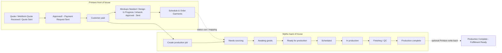
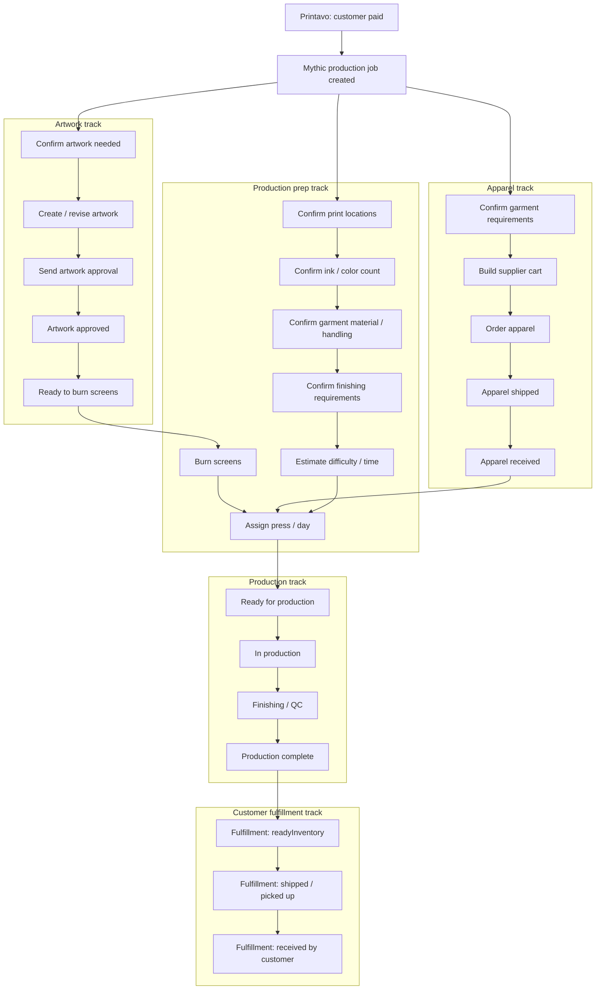
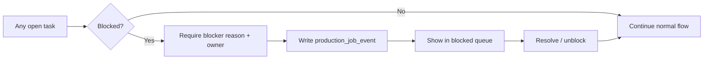

# Production Process Tree

Last updated: 2026-07-14

Purpose: model how Printavo front-of-house order states connect to Mythic
back-of-house production work, including parallel task tracks and the rules the
app can use to suggest advancing a job.

This is a first-pass model. It is intentionally simple.

## Mental Model

- Printavo owns the customer/commercial lifecycle: quote, approval, payment,
  customer communication, and customer-facing status.
- Mythic owns the production lifecycle: sourcing, receiving, art/prep,
  scheduling, production, finishing, and exceptions.
- One Mythic `production_job` relates to one Printavo order.
- Mythic should create the `production_job` when the customer pays. Printavo
  remains the source of truth for payment/customer-facing status, but payment is
  the handoff point where Mythic begins tracking back-of-house work.
- A job has one headline production phase, but several task tracks can run in
  parallel.
- The app should suggest advancing when required tasks are complete, but humans
  should confirm important phase changes at first.
- During store hours, Mythic should poll Printavo every 15 minutes for status
  changes and payment/order updates. Polling should create sync events and
  suggestions, not silently make risky production moves.

## High-Level Process



## Parallel Task Tracks

Once the customer pays in Printavo, Mythic creates a production job with
parallel task tracks. The later Printavo status `Schedule & Order Garments` can
still be used as a mapped status cue, but payment is the expected creation
trigger.

These tracks do not all wait for one another. Artwork and apparel sourcing can
happen at the same time.



## Printavo Sync And Polling

Mythic should stay updated by polling Printavo during store hours.

First-pass polling rule:

- Poll interval: every 15 minutes.
- Active window: store hours only.
- Sources to check: order status, payment/order updates, and any fields used by
  status mappings.
- Each poll writes a sync run record.
- Each meaningful change writes a `production_job_event`.
- Each mapped change creates a suggestion or safe automatic update.

Payment should be the main production-job creation trigger:

```txt
If Printavo indicates customer payment received
and no production_job exists for that Printavo order
then suggest/create Mythic production job.
```

`Schedule & Order Garments` remains important, but should be treated as a
production workflow cue rather than the only possible job creation trigger.

```txt
If Printavo status becomes Schedule & Order Garments
and production_job exists
then suggest opening/confirming sourcing tasks.
```

Open question: confirm the exact Printavo API signal for "customer paid." It may
come from order payment fields, payment records, status changes, or message/event
metadata.

## Supplier Apparel Status Detail

The apparel track covers blank/apparel sourcing before production. These states
describe supplier-side movement of the goods that will be printed.

| Status | Meaning | Suggested Next Action |
| --- | --- | --- |
| `ordered` | Apparel order has been placed with supplier. | Move job to awaiting goods. |
| `shipped` | Blank apparel has shipped from supplier. | Track ETA and prepare receiving task. |
| `received` | Blank apparel has arrived and has been counted/reconciled. | Release job toward production prep if art/screens/specs are ready. |

These statuses should live on the apparel/receiving task track. The job headline
might still be `awaiting_goods` while the supplier apparel task is `shipped`.

## Customer Fulfillment Status Detail

Post-production fulfillment describes what happens after printed goods are ready
to leave Mythic and get to the customer.

A first-pass customer fulfillment status enum:

| Status | Meaning | Suggested Next Action |
| --- | --- | --- |
| `readyInventory` | Printed goods are complete, packed or staged, and ready for pickup/shipping/customer delivery. | Notify customer, prepare pickup/shipping, or hand off to fulfillment. |
| `shipped` | Printed goods have shipped or left Mythic for customer delivery. | Track delivery or wait for confirmation. |
| `received` | Customer has received or picked up the completed order. | Close fulfillment/customer delivery loop. |

These statuses should live on a post-production fulfillment/customer delivery
track. They are separate from supplier apparel ordering and receiving.

## Production Prep Detail

The `Confirm print specs` idea should probably become several smaller tasks.
This is where Mythic can turn loose production knowledge into scheduling data.

| Task | Purpose | Example Data |
| --- | --- | --- |
| Confirm print locations | Make sure every print location is known before prep. | Front, back, sleeve, tag, left chest. |
| Confirm ink / color count | Estimate screen/setup complexity. | 1-color front, 2-color back, white underbase. |
| Confirm garment material / handling | Capture production risk and handling needs. | Cotton tee, fleece hoodie, tote, nylon, youth sizing, mixed garments. |
| Confirm finishing requirements | Capture work after printing. | Fold, bag, size sort, hang tags, pickup bins, shipping prep. |
| Confirm quantity and spoilage buffer | Verify run size and expected extras. | 420 units, 5 extra blanks, 2% spoilage buffer. |
| Estimate difficulty / time | Convert specs into scheduling inputs. | Difficulty `3`, estimated `2.5` hours, press `ROQ-B`. |

These tasks can happen while apparel is still awaiting delivery, but the job
should not be suggested as `Ready for production` until the required prep tasks
and receiving tasks are complete.

## Suggested Advancement Rules

These rules should create suggestions, not silent automation, until the team
trusts the workflow.

| Suggested Move | Required Conditions | Suggested Prompt |
| --- | --- | --- |
| Create Mythic production job | Customer payment is received in Printavo | `Customer payment is received. Create production job?` |
| Move to `Needs sourcing` | Production job exists and garment requirements are incomplete or unordered | `Garment requirements need sourcing. Open sourcing tasks?` |
| Move to `Awaiting goods` | Supplier cart/order task is complete | `Apparel appears ordered. Move job to awaiting goods?` |
| Update supplier apparel to `shipped` | Supplier shipment is confirmed | `Blank apparel appears shipped. Start receiving watch?` |
| Update supplier apparel to `received` | Blank apparel has arrived and receiving/count-in is complete | `Blank apparel has been received. Release goods for production?` |
| Move to `Ready to burn screens` | Artwork approved | `Artwork is approved. Move screen prep to ready?` |
| Move to `Ready for production` | Apparel received, artwork approved, screens ready, print specs confirmed, estimate completed | `All production prerequisites look complete. Move to Ready For Production?` |
| Move to `Scheduled` | Production lead assigns press/day/team | `Press and day assigned. Mark job scheduled?` |
| Move to `In production` | Worker starts production task or lead manually starts job | `Production work has started. Mark job In Production?` |
| Move to `Finishing / QC` | Production run task complete | `Run is complete. Move to finishing/QC?` |
| Move to `Production complete` | Finishing/QC complete and no open blockers | `All production tasks are complete. Mark production complete?` |
| Update customer fulfillment to `readyInventory` | Printed goods are complete and staged/packed | `Printed goods are ready. Mark fulfillment readyInventory?` |
| Update customer fulfillment to `shipped` | Order has shipped or left Mythic for delivery | `Order has shipped. Mark customer fulfillment shipped?` |
| Update customer fulfillment to `received` | Customer pickup/delivery is confirmed | `Customer has received the order. Mark fulfillment received?` |

## Blocked Rules

Any track can be blocked without changing the whole job to a terminal state.

Examples:

- Artwork blocked: awaiting customer details or approval.
- Apparel blocked: shortage, substitution decision, vendor issue, damaged goods.
- Prep blocked: screens not ready, print specs unclear, press unavailable.
- Production blocked: machine issue, reprint decision, missing goods.



## Estimation Model

Each production job should have an estimate that can be used for scheduling and
later compared against tracked time.

First-pass fields:

- `difficulty_score`: simple 1-5 score.
- `estimated_minutes`: expected production time.
- `setup_minutes`: estimated setup/prep time.
- `run_minutes`: estimated active print time.
- `finishing_minutes`: estimated finishing/QC time.
- `estimate_confidence`: low, medium, or high.
- `estimate_note`: short human explanation.

Suggested difficulty scale:

| Score | Label | Meaning |
| ---: | --- | --- |
| 1 | Simple | Single location, low quantity, straightforward garment, low risk. |
| 2 | Standard | Normal shop work with predictable setup and run time. |
| 3 | Moderate | Multiple locations, higher quantity, mixed sizes/garments, or extra handling. |
| 4 | Complex | Multi-color or multi-location job with meaningful setup/QC risk. |
| 5 | High risk | Rush, reprint risk, difficult garment/material, tight deadline, or unusual finishing. |

The first version can allow a production lead to enter the estimate manually.
Later, Mythic can suggest an estimate from quantity, print locations, color
count, garment type, finishing requirements, and historical tracked time.

Example estimate prompt:

```txt
Specs confirmed:
- 420 tees
- Front + back print
- 2 screens
- Fold by size

Suggested difficulty: 3 / Moderate
Suggested estimate: 150 minutes

Use this estimate?
```

## Role Rules

- Production workers can advance their assigned tasks and move work forward.
- Receiving/sourcing staff can advance tasks in their tracks.
- Production leads can assign, block, unblock, advance, and perform limited
  backward moves within the production workflow.
- Admins and owners can move jobs backward, skip steps, or correct state, but
  backwards/override moves should require a reason.
- Every state change should create a `production_job_event`.

## Data Model Implications

Minimum entities:

- `production_jobs`: current headline state and Printavo order reference.
- `production_tasks`: parallel and sequential work items.
- `production_job_events`: immutable audit trail.
- `printavo_status_mappings`: which Printavo statuses create or update Mythic
  jobs.

Useful `production_jobs` Printavo sync fields:

- `printavo_order_id`
- `printavo_order_number`
- `printavo_status_id`
- `printavo_status_name`
- `printavo_paid_at`
- `last_printavo_synced_at`
- `printavo_sync_source`

Useful `production_jobs` estimate fields:

- `difficulty_score`
- `estimated_minutes`
- `setup_minutes`
- `run_minutes`
- `finishing_minutes`
- `estimate_confidence`
- `estimate_note`

Useful supplier apparel task fields:

- `supplier_apparel_status`: `ordered`, `shipped`, or `received`
- `supplier_name`
- `supplier_order_number`
- `tracking_number`
- `shipped_at`
- `received_at`
- `received_quantity`
- `expected_quantity`
- `receiving_note`

Useful customer fulfillment task fields:

- `customer_fulfillment_status`: `readyInventory`, `shipped`, or `received`
- `ready_inventory_at`
- `fulfilled_at`
- `customer_received_at`
- `fulfillment_method`: pickup, local_delivery, shipping, or other
- `fulfillment_tracking_number`
- `fulfillment_note`

Optional later:

- `production_phase_transitions`: configurable transition rules if admins need
  to manage the workflow without code changes.
- `printavo_orders`: full local mirror of all Printavo orders if we need to
  track pre-production orders before they become production jobs.

## First-Pass Internal States

Headline production phases:

- `needs_sourcing`
- `awaiting_goods`
- `goods_received`
- `ready_for_production`
- `scheduled`
- `in_production`
- `finishing_qc`
- `production_complete`
- `blocked`
- `cancelled`

Task states:

- `open`
- `in_progress`
- `blocked`
- `complete`
- `cancelled`
- `skipped`

Supplier apparel task states:

- `ordered`
- `shipped`
- `received`

Customer fulfillment task states:

- `readyInventory`
- `shipped`
- `received`
